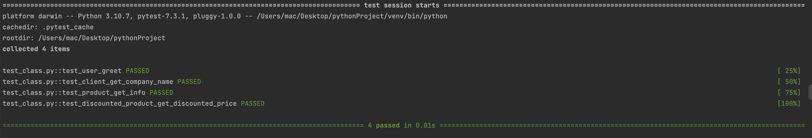

# My Project

This is a project that demonstrates how to use pytest to write and run tests.

## Installation

1. Create a new directory for your project and navigate to that directory in the terminal or command prompt.

2. Create a virtual environment by running the following command:

   ```bash
   python -m venv venv
3. Activate the virtual environment:

   . On Windows:
     ```bash
     venv\Scripts\activate 
   ```
   
    . On macOS and Linux:
    ```bash
     source venv/bin/activate 
   ```
4. Install pytest by running the following command:

     ```bash
    pip install pytest
   ```
5. Run this command line 
      ````bash 
        pytest test_myclass.py
    ````
------


